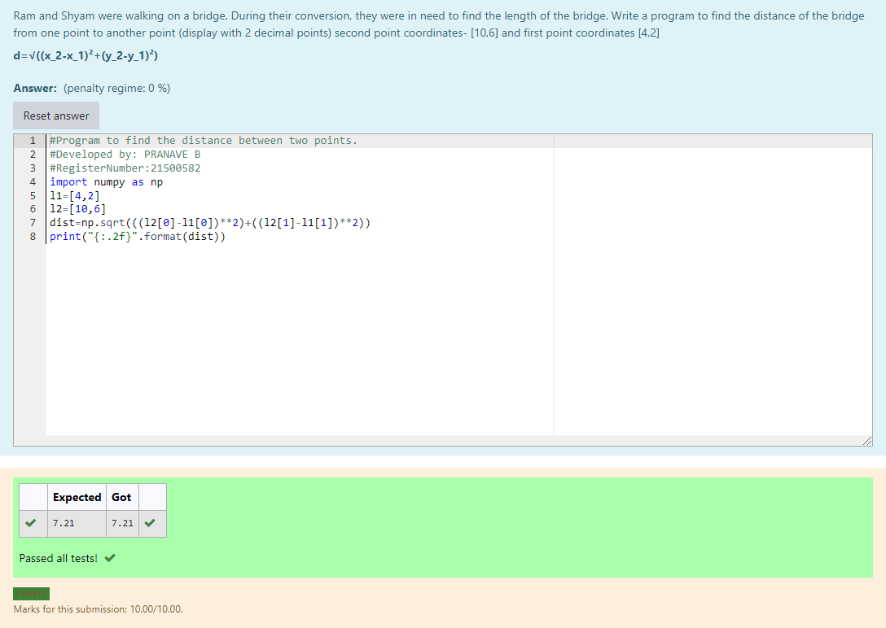

# DISTANCE-BETWEEN-TWO-POINTS

## AIM:
To write a python program to find the distance two 2 points
## ALGORITHM:

### Step 1: 
Get 4 inputs fro  the user
### Step 2: 
calulate the distance between 2 points by using the formula
### Step 3: 
Substitute the values in the distance formula  
 
### Step 4: 
Print the output

### PROGRAM:
~~~
#Program to find the distance between two points.
#Developed by: PRANAVE B
#RegisterNumber:21500582
import numpy as np
l1=[4,2]
l2=[10,6]
dist=np.sqrt(((l2[0]-l1[0])**2)+((l2[1]-l1[1])**2))
print("{:.2f}".format(dist))
~~~  

### OUTPUT:

### RESULT:

Now we have successfully calculated the distance between two points
